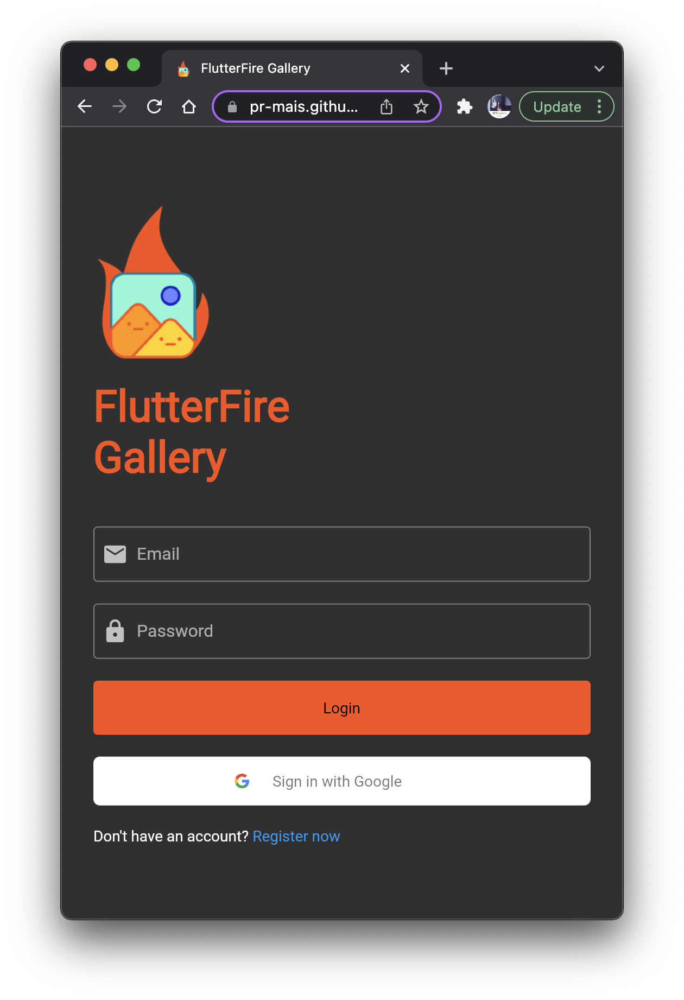
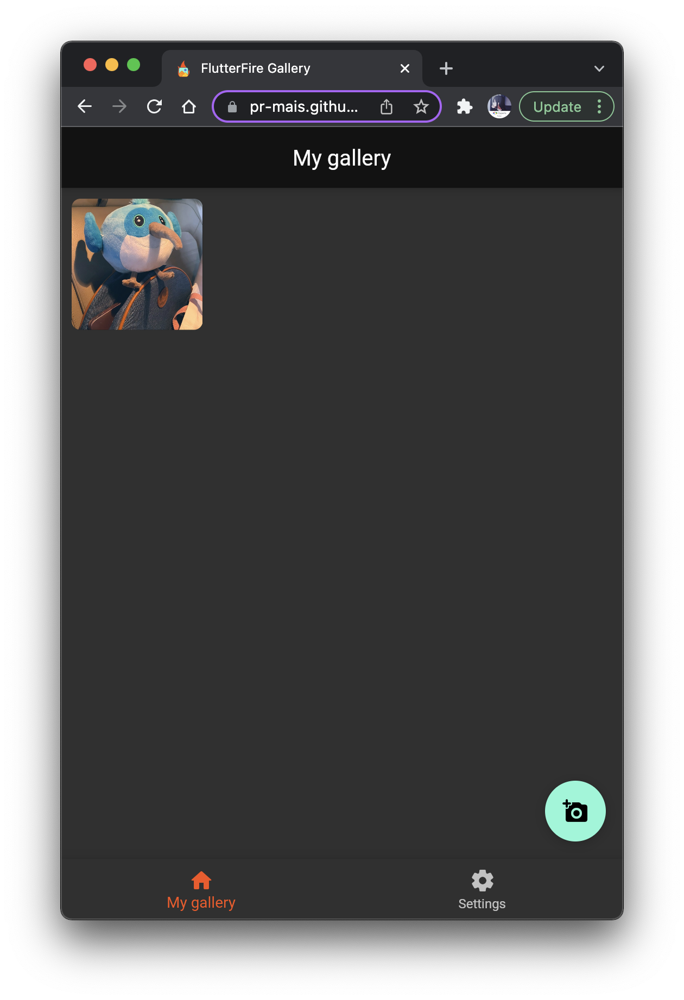
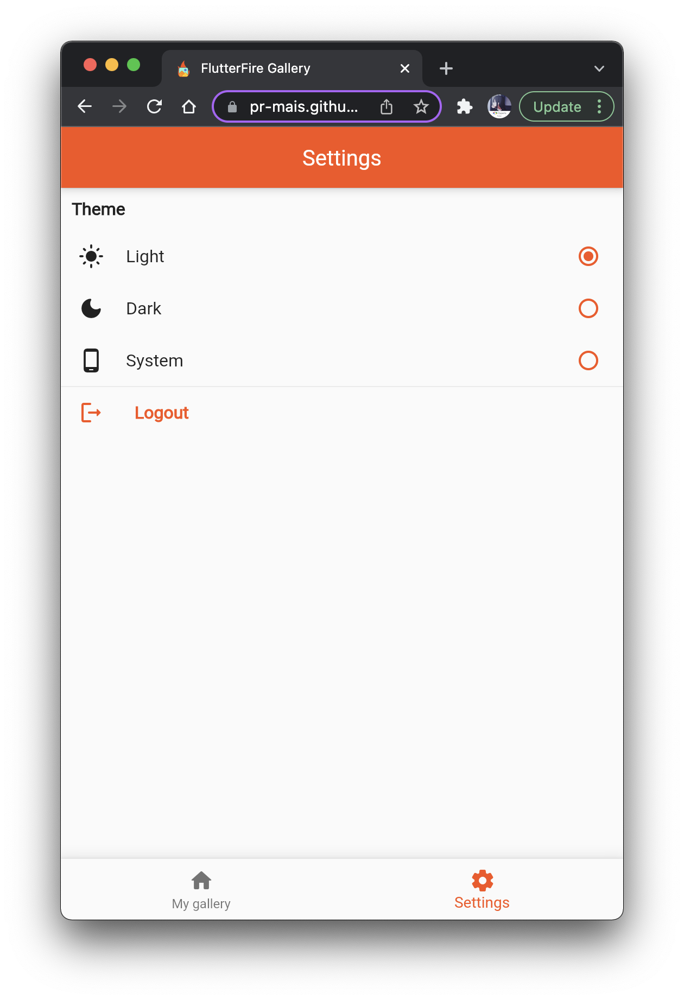
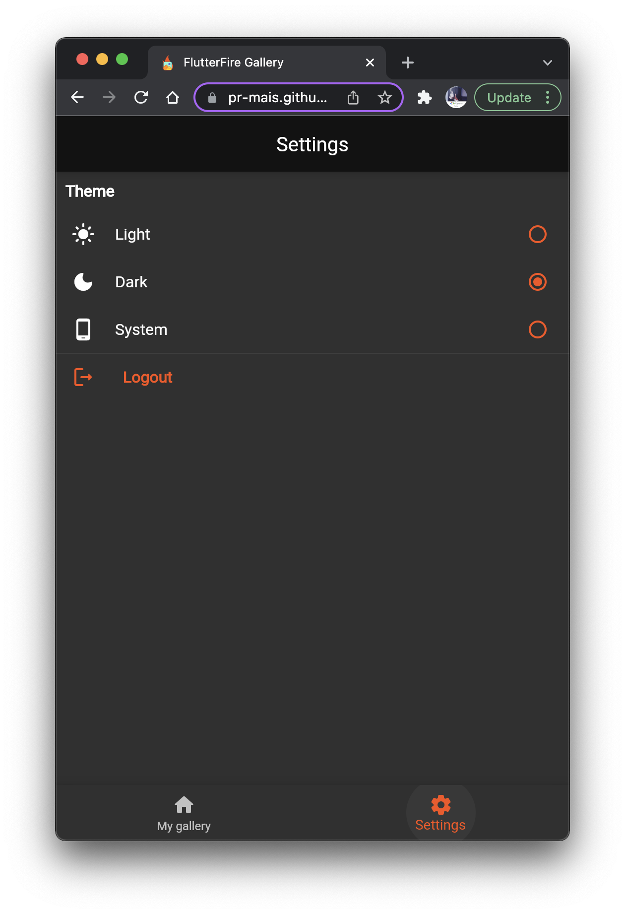

#  FlutterFire Gallery

A sample Flutter app to upload images and share them via links and in-app.

The app shows usage of following Firebase packages:
1. [firebase_core](https://firebase.flutter.dev/docs/core/overview)
2. [firebase_auth](https://firebase.flutter.dev/docs/auth/overview)
3. [firebase_storage](https://firebase.flutter.dev/docs/storage/overview)

## Screenshots

        
   
     
      

## Getting Started

The project is structured as tutorial steps via commits, each commit has sufficient description of what's included in that step.

You can play around with the app on web by visiting [pr-mais.github.io/flutterfire_gallery](https://pr-mais.github.io/flutterfire_gallery).

## Further resources

- [Click to get a copy of the workshop slides.](https://docs.google.com/presentation/d/118TIWQ6PGzmzNleCmIjsAptAv0Z3N5PRT9HL6ZXf69E/edit?usp=sharing&resourcekey=0-Oxiqvu3tU9hzKm1YQhhazQ)
- [Flutter official website.](https://flutter.dev)
- [Flutter YouTube channel.](https://www.youtube.com/channel/UCwXdFgeE9KYzlDdR7TG9cMw)
- [Firebase official docs.](https://firebase.google.com/docs/)
- [FlutterFire official docs.](https://firebase.flutter.dev/docs/overview)